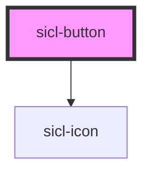

# sicl-button

<!-- Auto Generated Below -->

## Properties

| Property    | Attribute    | Description | Type                                                 | Default     |
| ----------- | ------------ | ----------- | ---------------------------------------------------- | ----------- |
| `class`     | `class`      |             | `"danger" \| "primary" \| "secondary" \| "tertiary"` | `'primary'` |
| `disabled`  | `disabled`   |             | `boolean`                                            | `false`     |
| `iconLeft`  | `icon-left`  |             | `string`                                             | `undefined` |
| `iconRight` | `icon-right` |             | `string`                                             | `undefined` |
| `name`      | `name`       |             | `string`                                             | `undefined` |
| `type`      | `type`       |             | `string`                                             | `'button'`  |

## Dependencies

### Depends on

- [sicl-icon](../sicl-icon)

### Graph

----------------------------------------------

*Built with [StencilJS](https://stenciljs.com/)*
