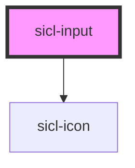

# sicl-input

<!-- Auto Generated Below -->

## Properties

| Property         | Attribute         | Description | Type                               | Default     |
| ---------------- | ----------------- | ----------- | ---------------------------------- | ----------- |
| `disabled`       | `disabled`        |             | `boolean`                          | `undefined` |
| `formAssociated` | `form-associated` |             | `boolean`                          | `undefined` |
| `iconLeft`       | `icon-left`       |             | `string`                           | `undefined` |
| `iconRight`      | `icon-right`      |             | `string`                           | `undefined` |
| `inputId`        | `input-id`        |             | `string`                           | `undefined` |
| `labelText`      | `label-text`      |             | `string`                           | `undefined` |
| `max`            | `max`             |             | `number`                           | `undefined` |
| `maxLength`      | `max-length`      |             | `number`                           | `undefined` |
| `min`            | `min`             |             | `number`                           | `undefined` |
| `minLength`      | `min-length`      |             | `number`                           | `undefined` |
| `name`           | `name`            |             | `any`                              | `undefined` |
| `placeholder`    | `placeholder`     |             | `any`                              | `undefined` |
| `required`       | `required`        |             | `boolean`                          | `undefined` |
| `step`           | `step`            |             | `"any" \| number`                  | `undefined` |
| `type`           | `type`            |             | `"number" \| "password" \| "text"` | `'text'`    |

## Dependencies

### Depends on

- [sicl-icon](../sicl-icon)

### Graph

----------------------------------------------

*Built with [StencilJS](https://stenciljs.com/)*
